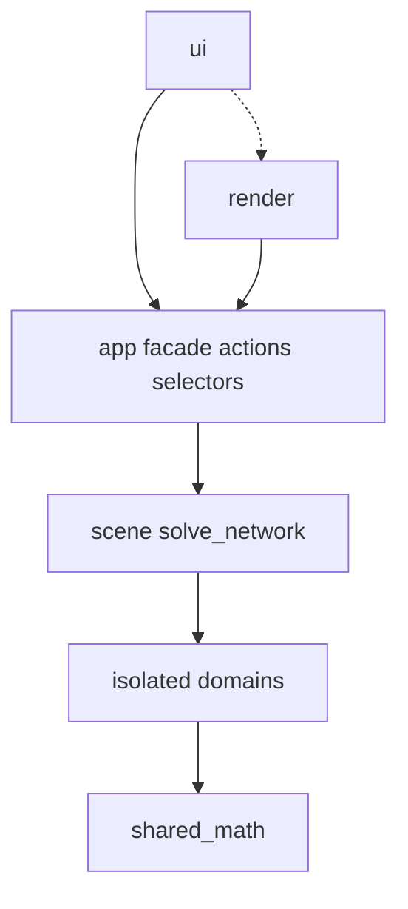

# Finished P0 composition tool

Authority: Governing Build Specification v1 (Coupled Composition + Print Gallery Tool), 13 Aug 2026.

Build **one finished tool**. Stop when spec §27 items 1–19 are all true in one project. Spec in. Nothing else.

Purpose (spec p.4): reconstruct and redesign P0 with one physically coherent body, phone/camera and finite mirror, such that exact Print Gallery recursion arises automatically from the reflected phone screen whenever that screen is validly visible.

## In / out

**In:** spec §§0–27, Appendices A–F, P0 I01 digitisation, optical special case as DIAGNOSTIC_ONLY, de Smit/Lenstra scale-256 kernel.

**Out:** Mega Build intent/gates; panel-space; correspondence morph; contradiction catalogue; Fourier/exotic warps; Mirror Rig / Loop Lab apps; v1.4 packaging; ARTWORK panel; water/hair/misaddress/paint theory; environment beyond floor/support/occlusion/reference; second portal widget; any parallel implementation of projection, reflection, homography, or the log map.

α, lattice, γ: spec §18 and Appendix A. Kernel tests §25.8 are the numeric oracle. Do not keep an alternate formula.

## Architecture



UI never owns physical truth. Renderers never own physical truth. Three.js/WebGL types exist only at render boundaries. CPU recursion is authority; GPU matches UV/lattice/singularity/P-Q within tolerance — not a second kernel.

Source layout is spec §26 exactly:

```
src/app/          facade.js actions.js selectors.js project_io.js
src/scene/        requested_state.js effective_state.js solve_network.js
                  solve_policy.js history.js proposals.js
src/domains/      body/ pose/ support/ hand_grip/ phone/ camera/
                  apparatus/ mirror/ reflection/ visibility/
                  composition/ carrier_p/ content_q/ recursion/ export/
src/shared_math/  vector.js quaternion.js transform.js projection.js
                  intersection.js polygon.js homography.js complex.js
                  numerical.js jacobian.js
src/render/       scene_3d.js artwork_camera.js overlays.js
                  recursion_gpu.js diagnostics.js
src/ui/           interactions.js contextual_controls.js
                  numeric_entry.js reference_overlay.js
src/workers/      network_solve_worker.js recursion_cpu_worker.js
                  export_worker.js
fixtures/         P0/ optical_special_case/ recursion/
tests/
tools/validate.py
```

`tools/validate.py` rejects: UI importing solver internals; duplicate projection/reflection/homography/log-map; production `ROTATE_MIRROR`; a second portal type; generated HTML treated as source. No other top-level product trees.

## One owner per quantity

Do not expose the same degree of freedom twice.

- requested vs effective — `src/scene/`
- body definition vs pose — `domains/body`, `domains/pose`
- wrist / grip / phone / screen / optical centre — kept separate
- capture camera — derived `T_WC = T_WP T_PC` when carrier is PHONE
- production mirror — apparatus `M = C + d_M f + p_u r + p_v u`, `n_M = −f_C`
- general mirror plane — `domains/mirror` for tests/calibration only
- P — DERIVED from reflected physical screen
- Q — authored; never moves P or the apparatus
- artwork view — `render/artwork_camera.js`; must not write capture camera
- Print Gallery field — `domains/recursion`, `I(z)=F(W(z))`

Relation classes (spec §2.3): FREE, LOCKED, RELATION_LOCKED, DERIVED, AUTO_SOLVED, TARGETED, BOUNDED, EXPLORATORY.

Every edit names DRIVER / PRESERVE / ALLOWED_TO_MOVE. Transactions: PASS | PROJECTED | FAIL. Out-of-policy moves are proposals, never silent writes.

World: +X parallel to default mirror, +Y depth along default normal, +Z up, floor Z=0. Anatomical L/R is semantic.

## Finished behaviour

Modes: POSE | SCENE | COMPOSITION | RECURSION | INSPECT. One selection, one overlay. Actions/selectors = spec §22 (no production `ROTATE_MIRROR`). Startup = spec §24. Overlays = spec §14. Solve modes = spec §13.6. Four named pan actions, not one pan.

**Warp toggle** is spec `PRINT_GALLERY OFF | AUTO | ADVANCED`. OFF: physical scene, Q on the screen, no loop. AUTO: if P valid, derive P, rectify, exact one-centre loop, certify, render; else named unavailability. ADVANCED: same P, selected loop controls, never detaches from P. Toggle does not move geometry.

**RECURSION view** is the finished use of AUTO (spec §§17, 20, 21.1, 25.9, 27.15–17):

- dolly view camera along `C + s d_M f` from capture pose to the mirror (workspace; does not mutate capture camera)
- approach the reflected phone until P fills the artwork frame
- AUTO on: further zoom is `W(z)=α log(z−p)+β`, one visual period `log|γ|`
- OFF: stop at filled P (magnified Q)

Whenever AUTO is on, P is already textured by `I(z)`. Dolly/zoom are views of that field. A cut from 3D raster to a second Droste shader is out of spec. Physical portal size is not `|γ|`.

**Export** (`domains/export`, spec §27.19): PNG of the current artwork frame at current warp state and view; unwarped sibling when AUTO; staging prescription; composition overlay; recursive reference render; sidecar (mode, view, P validity, certificate). JSON without pixels is not export.

## Build order

Same finished tool. No intermediate products.

1. Graph, `shared_math`, fixtures — `validate.py`, §25.1, P0 table §1.1, kernel §18 / §25.8. Parallel-case equations DIAGNOSTIC_ONLY, not a second solver.
2. Body, pose, support, IK — §§6–7, §25.2. Two-bone IK is a seed; production solve is coupled. Startup = P0 family.
3. Phone, camera, apparatus, mirror — §§5, 8–9, §25.3–25.4. Controls: distance, aperture, U/V pan, autosolve, preserved reflected-phone ratio. FOV is a network variable.
4. Reflection, visibility, P — §§11, 16, §25.5. Changing Q must not change P.
5. Composition net — §§12–13, §25.6, Appendix C. P0_RECONSTRUCT reports residuals; zero residual is not required. No composition score.
6. Q, recursion, artwork view, image export — §§17–20, §25.7–25.8. Warp toggle, AUTO attach, inverse-map sampling, no-fold, CPU reference, GPU parity.
7. Facade, overlays, UI — §§14, 21–24, §25.9. Full action list. Warp toggle and view scrub in RECURSION. Compensation inspectable.
8. Persistence until §27 — save/restore requested state, warp mode, artwork view. Stop only when §27.1–27.19 hold together.

## Tests

Spec §25 is the suite. CPU kernel is authority. Fixture PASS is not physical evidence.

Also required for the RECURSION view:

- AUTO available iff P valid
- moving phone updates P and the field; moving Q does not
- warp toggle frozen-geometry round trip
- artwork dolly does not write capture camera
- pixel residual across portal-fill
- `I(τ)` vs `I(τ+log|γ|)` after lattice reduction
- PNG ON and OFF at the same view

## Done

§27.1–27.19 simultaneously: P0 loaded; pose and phone edits with coupled IK; camera and mirror relation-locked; named pans; composition fit with explicit residuals; AUTO portal from valid P; Q independent; loop certificate visible; warp toggleable; artwork view travels camera→mirror→phone and continues through the loop without a pop; image export of current view.

Non-conformant: manual Droste rectangle; independent production mirror rotation; hidden solver compensation; duplicate DOF; second implementation of the same map.
